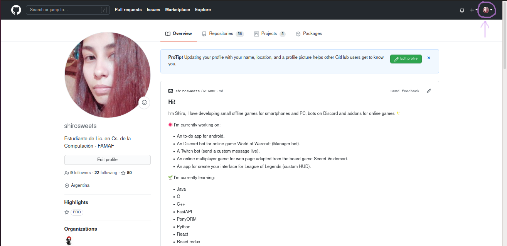
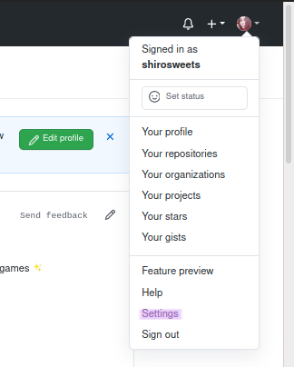

# how-to-add-co-author

## Index
[Add co-author](https://github.com/shirosweets/how-to-add-co-author/blob/main/README.md#how-to-add-commit-with-co-author-or-multiple-co-authors)

[Private email on GitHub](https://github.com/shirosweets/how-to-add-co-author/blob/main/README.md#hot-to-get-your-email-with-usersnoreplygithubcom)

### How to add commit with co-author or multiple co-authors:
```
$ git commit -m "Title
>
>
Co-authored-by: Valentina <60824319+shirosweets@users.noreply.github.com>
Co-authored-by: name <name@example.com>"
```

Then push your commit

### Hot to get your email with @users.noreply.github.com:

In your GitHub profile, go on settings:




And copy your github email

